# Bezpieczeństwo komputerowe - [lab6](sec-lab6.pdf)

<br />

## Zadanie 1

* Certyfikat strony [pwr.edu.pl](https://pwr.edu.pl/)

    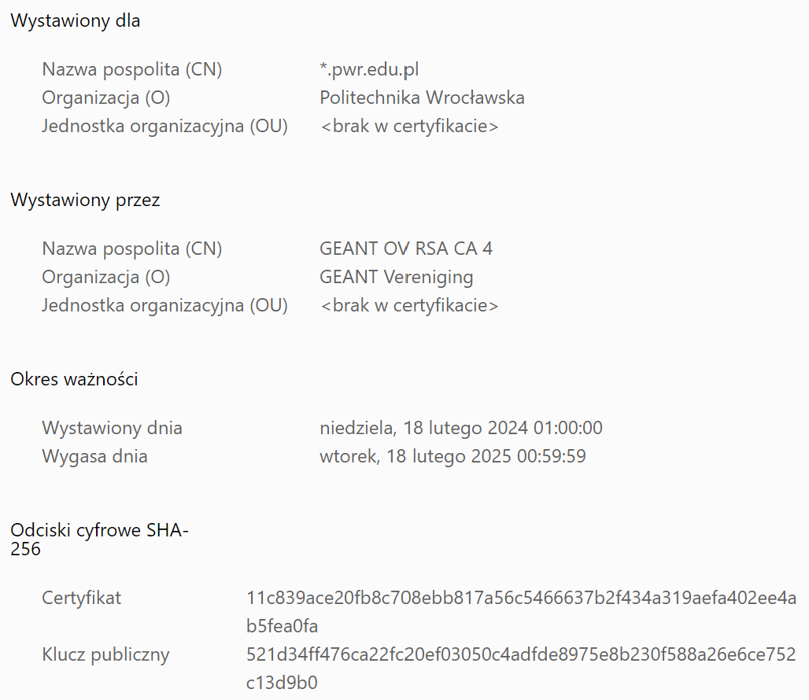

    Dodatkowo pobrany certyfikat znajduje sie w pliku [_.pwr.edu.pl](ex1/_.pwr.edu.pl)

<br />

* **Sprawdzenie danych certyfikatu:**

    **Polcenie:** `openssl x509 -in ex1/_.pwr.edu.pl -text -noout`

    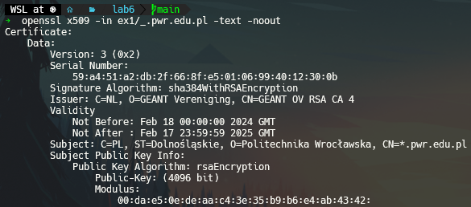

    **Użyte opcje:**
    * `x509` - manipulacja certyfikatami w [formacie X.509](https://en.wikipedia.org/wiki/X.509)
    * `-in` - ścieżka do pliku z certyfikatem
    * `-text` - wyswietlenie szczegółów certyfikatu
    * `-noout` - zapobiega wyświetleniu zakodowanej formy certyfikatu

    <br />

    **Dane o certyfikacie:**
    * Podpisujący: `Issuer: C=NL, O=GEANT Vereniging, CN=GEANT OV RSA CA 4`
    * Algorytm podpisu: `Signature Algorithm: sha384WithRSAEncryption`
    * Data ważności certyfikatu:
        ```
        Validity
            Not Before: Feb 18 00:00:00 2024 GMT
            Not After : Feb 17 23:59:59 2025 GMT
        ```
    * Dla kogo jest certyfikat: `Subject: C=PL, ST=Dolnośląskie, O=Politechnika Wrocławska, CN=*.pwr.edu.pl`
    * Jakie domeny obejmuje certyfikat:
        ```
        X509v3 Subject Alternative Name:
            DNS:*.pwr.edu.pl, DNS:pwr.edu.pl
        ```
    * Jakie rozszerzenia X509 są obecne:
        ```
        X509v3 extensions:
            X509v3 Authority Key Identifier:
                6F:1D:35:49:10:6C:32:FA:59:A0:9E:BC:8A:E8:1F:95:BE:71:7A:0C
            X509v3 Subject Key Identifier:
                40:39:A6:1D:52:C6:67:81:14:06:84:5A:5D:83:48:C5:FF:4E:C4:60
            X509v3 Key Usage: critical
                Digital Signature, Key Encipherment
            X509v3 Basic Constraints: critical
                CA:FALSE
            X509v3 Extended Key Usage:
                TLS Web Server Authentication, TLS Web Client Authentication
            X509v3 Certificate Policies:
                Policy: 1.3.6.1.4.1.6449.1.2.2.79
                  CPS: https://sectigo.com/CPS
                Policy: 2.23.140.1.2.2
            X509v3 CRL Distribution Points:
                Full Name:
                  URI:http://GEANT.crl.sectigo.com/GEANTOVRSACA4.crl
            Authority Information Access:
                CA Issuers - URI:http://GEANT.crt.sectigo.com/GEANTOVRSACA4.crt
                OCSP - URI:http://GEANT.ocsp.sectigo.com
            X509v3 Subject Alternative Name:
                DNS:*.pwr.edu.pl, DNS:pwr.edu.pl
            CT Precertificate SCTs:
                ...
        ```
        * Identyfikator klucza urzędu certyfikacji
        * Identyfikator klucza podmiotu certyfikatu
        * Użycie klucza certyfikatu
        * Podstawowe ograniczenia certyfikatu
        * Rozszerzone użycie klucza
        * Zasady certyfikatu
        * Punkty dystrybucji listy CRL
        * Dostęp do informacji o urzędzie
        * Alternatywna nazwa podmiotu certyfikatu
        * Lista sygnatur czasowych podpisanego certyfikatu

    * Jakie jest URI do list CRL:
        ```
        X509v3 CRL Distribution Points:
            Full Name:
                URI:http://GEANT.crl.sectigo.com/GEANTOVRSACA4.crl
        ```

    * Jakie jest URI do serwisu OCSP?
        ```
        Authority Information Access:
            CA Issuers - URI:http://GEANT.crt.sectigo.com/GEANTOVRSACA4.crt
            OCSP - URI:http://GEANT.ocsp.sectigo.com
        ```

<br />

* **Weryfikacja certyfikatu:**

    **Polcenie:** `openssl verify -CAfile <ca-root-cert> -untrusted <all-intermediate-certs> ex1/_.pwr.edu.pl`

    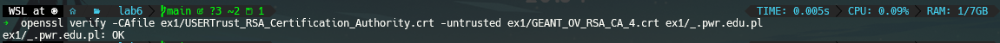

    **Zaufana ścieżka:**

    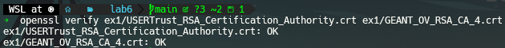

<br />

* **Status OCSP certyfikatu:**

    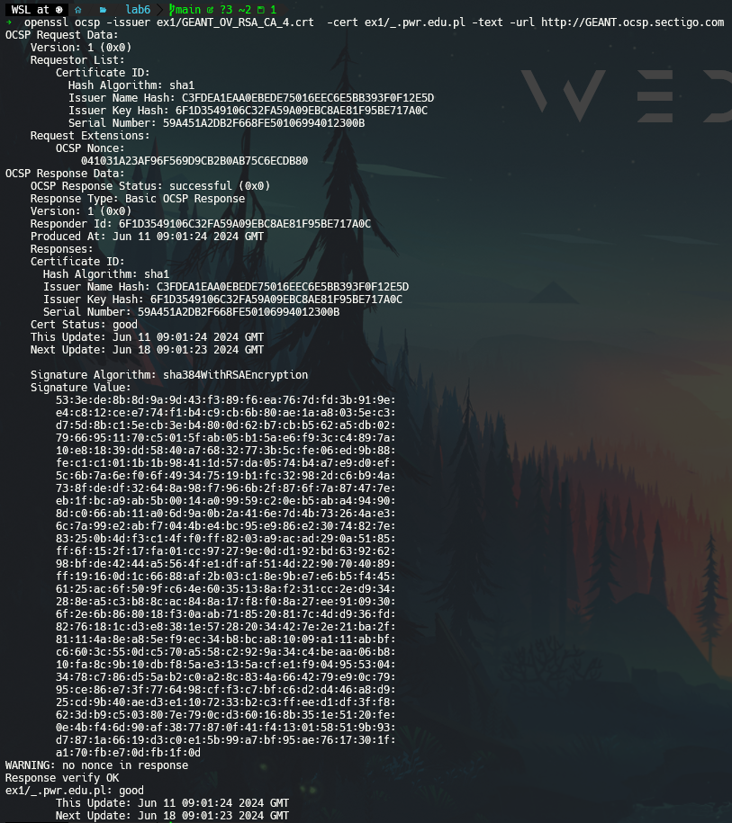

<br />
<br />
<br />

## Zadanie 2

* **Generowanie pary kluczy:**
    * Prywatny: `openssl genrsa -out ex2/priv_key.key 2048`
    * Publiczny: `openssl rsa -in ex2/priv_key.key -pubout > ex2/pub_key.pub`

* **Generowanie żądania certyfikatu**: `openssl req -x509 -new -key ex2/priv_key.key -days 365 -out ex2/cert.pem`

    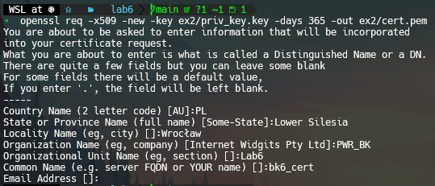

    Użyte opcje:
    * `req` - tworzy żądanie certyfikatu (CSR)
    * `x509` - określa format certyfikatu jako [X.509](https://en.wikipedia.org/wiki/X.509)
    * `-new` - tworzy nowe żądanie certyfikatu (w kontekście użycia z opcją `-x509` znaczy że generowany jest nowy certyfikat)
    * `-key` - ścieżka do pliku z kluczem prywatnym, który będzie służył do podpisu certyfikatu
    * `-days` - określa okres ważności certyfikatu
    * `-out` - ścieżka do pliku wyjściowego, w którym zostanie zapisany stworzony certyfikat

<br />
<br />
<br />

## Zadanie 3

Uruchomienie WebGoat:

```shell
docker run -it -p 127.0.0.1:8080:8080 -p 127.0.0.1:9090:9090 webgoat/webgoat
```

W przeglądarce: `http://localhost:8080/WebGoat`

<br />

* **Zadanie 2:** Sprawdzanie plików cookie

    W konsoli: `alert(document.cookie);`

    Wynik w pierwszej zakładce:

    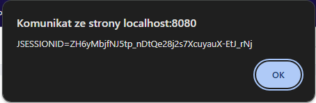

    Wynik w drugiej zakładce:

    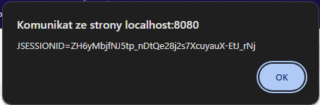

<br />

* **Zadanie 7:** Reflected XSS

    Jedynym polem podatnym na XSS jest pole z numerem karty kredytowej. Po wpisaniu `<script>alert("HEHE")</script> in credit card` w tym polu pokazuje się powiadomienie:

    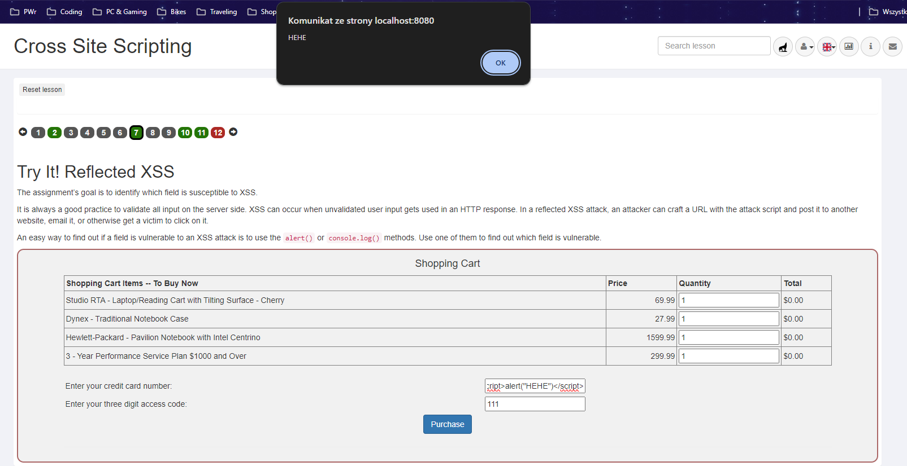

    Po wpisaniu podobnego skryptu w pole "access code" otrzymujemy następujący wynik:

    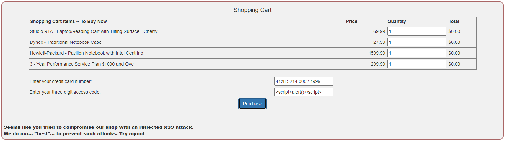

    Pola "quantity" nie są podatne, ponieważ można w nich wpisywać ograniczony zbiór znaków.

<br />

* **Zadanie 10:** Identyfikacja potencjalnego DOM-Based XSS

    DOM-based XSS (Cross-Site Scripting) to rodzaj ataku XSS, w którym złośliwy kod JavaScript jest wstrzykiwany i wykonywany bezpośrednio w przeglądarce użytkownika, poprzez manipulację modelem DOM (Document Object Model) strony internetowej. W przeciwieństwie do tradycyjnych ataków XSS, które polegają na wstrzykiwaniu złośliwego kodu w odpowiedzi serwera, DOM-based XSS atakuje stronę poprzez modyfikację strony internetowej po jej załadowaniu przez przeglądarkę, zazwyczaj przy użyciu JavaScriptu.

    Znaleziona trasa kodu testowego: `start.mvc#test/`

    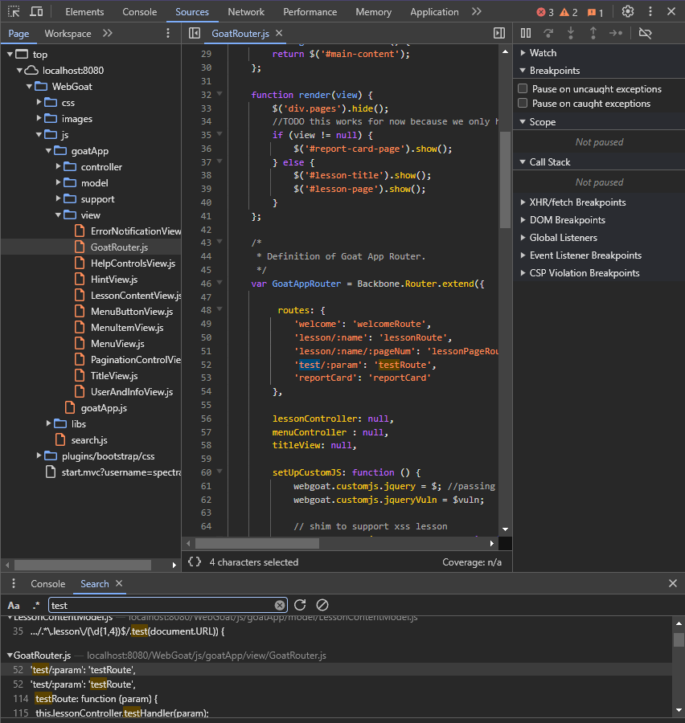

<br />

* **Zadanie 11:** DOM-Based XSS

    By wywołać zadaną funkcję: `webgoat.customjs.phoneHome()` możemy użyc złośliwego URL, w którym dodamy scrypt ją wywołujący:
    ```
    http://localhost:8080/WebGoat/start.mvc#test/<script>webgoat.customjs.phoneHome()<%2Fscript>
    ```

    > `%2F` to kod UTF-8 znaku `/`

<br />

* **Zadanie 12:** Test

    1. Are trusted websites immune to XSS attacks?

        No because the browser trusts the website if it is acknowledged trusted, then the browser does not know that the script is malicious.

    2. When do XSS attacks occur?

        The data is included in dynamic content that is sent to a web user without being validated for malicious content.

    3. What are Stored XSS attacks?

        The script is permanently stored on the server and the victim gets the malicious script when requesting information from the server.

    4. What are Reflected XSS attacks?

        They reflect the injected script off the web server. That occurs when input sent to the web server is part of the request.

    5. Is JavaScript the only way to perform XSS attacks?

        No there are many other ways. Like HTML, Flash or any other type of code that the browser executes.
